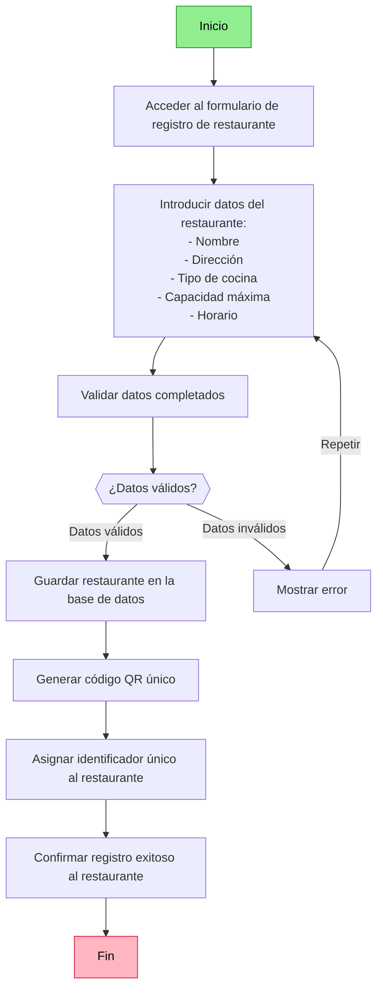

# Registro de Restaurante

```mermaid
activityDiagram
    title: Registro de Restaurante

    start
    : Inicio --> Acceder al formulario de registro de restaurante
    : Acceder al formulario de registro de restaurante --> Introducir datos del restaurante - - Nombre - Dirección - Tipo de cocina - Capacidad máxima - Horario
    : Introducir datos del restaurante - - Nombre - Dirección - Tipo de cocina - Capacidad máxima - Horario --> Validar datos completados
    : ¿Datos válidos? --> if "Datos válidos" --> Guardar restaurante en la base de datos
    : Mostrar error --> if "Repetir desde entrada" --> Introducir datos del restaurante - - Nombre - Dirección - Tipo de cocina - Capacidad máxima - Horario
    : Guardar restaurante en la base de datos --> Generar código QR único
    : Generar código QR único --> Asignar identificador único al restaurante
    : Asignar identificador único al restaurante --> Confirmar registro exitoso al restaurante
    : Confirmar registro exitoso al restaurante --> Fin
    stop
```

## Diagrama en estilo Flujo

